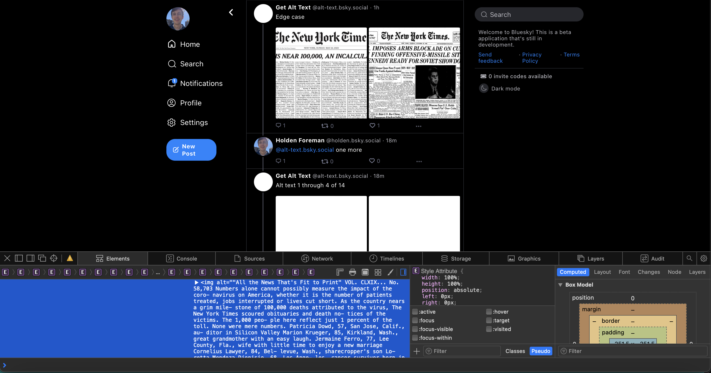

# bsky-alt-text-ocr

This is a bot that uses [the Google Cloud Vision API](https://cloud.google.com/vision) to extract text from post images and thread it in the replies as alt text.

This bot's implementation was inspired by and adopted from the [@altTextUtil](https://github.com/alt-text-org/AltTextCrew) bot [maintained on Twitter](https://twitter.com/AltTextUtil) by [Hannah Kolbeck](https://github.com/hkolbeck). A copy of her MIT license is included in this repo. Thank you, Hannah!

You should write your own alt text (learn more on [Accessible Social](https://www.accessible-social.com/images-and-visuals/alt-text-writing-tips) by [Alexa Heinrich](https://www.therealalexa.com)) for your posts whenever possible! This bot is not perfect. However, it is helpful as a stopgap measure for when people do post images of text without including useful alt text.

Thank you also to [Emily Liu](https://github.com/emilyliu7321), [epistemichorse](https://github.com/epistemichorse) and [Robert Cannon](https://github.com/robpc) for sharing examples that helped make this project possible.

Please don't hesitate to [contact me](mailto:hsforeman98@gmail.com) with any questions or feedback. Thank you!
